# TiketVault — Complete Workflow Diagrams

**Document status:** Current-state operational workflows  
**Starting point:** Organisation creation  
**Aligned to code:** 12 November 2026

---

## 1. End-to-end platform workflow

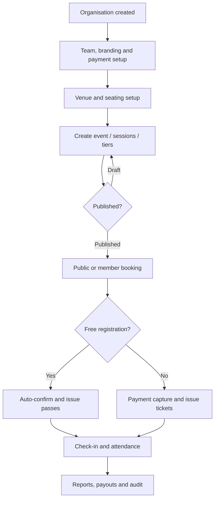
```mermaid
flowchart TD
    A[Organisation created] --> B[Team, branding and payment setup]
    B --> C[Venue and seating setup]
    C --> D[Create event / sessions / tiers]
    D --> E{Published?}
    E -- Draft --> D
    E -- Published --> F[Public or member booking]
    F --> G{Free registration?}
    G -- Yes --> H[Auto-confirm and issue passes]
    G -- No --> I[Payment capture and issue tickets]
    H --> J[Check-in and attendance]
    I --> J
    J --> K[Reports, payouts and audit]
```

---

## 2. Organisation creation and setup

### 2.1 Sequence

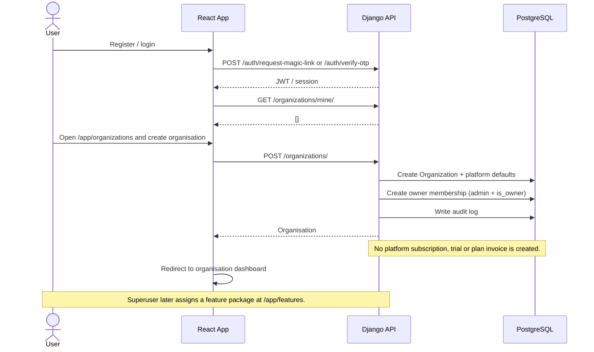
```mermaid
sequenceDiagram
    actor U as User
    participant FE as React App
    participant API as Django API
    participant DB as PostgreSQL

    U->>FE: Register / login
    FE->>API: POST /auth/request-magic-link or /auth/verify-otp
    API-->>FE: JWT / session
    FE->>API: GET /organizations/mine/
    API-->>FE: []
    U->>FE: Open /app/organizations and create organisation
    FE->>API: POST /organizations/
    API->>DB: Create Organization + platform defaults
    API->>DB: Create owner membership (admin + is_owner)
    API->>DB: Write audit log
    API-->>FE: Organisation
    Note over API,DB: No platform subscription, trial or plan invoice is created.
    FE->>FE: Redirect to organisation dashboard
    Note over U,API: Superuser later assigns a feature package at /app/features.
```

### 2.2 Organisation state

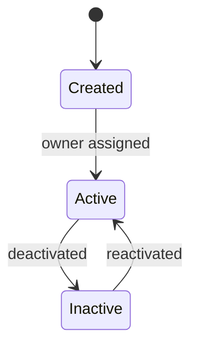
```mermaid
stateDiagram-v2
    [*] --> Created
    Created --> Active: owner assigned
    Active --> Inactive: deactivated
    Inactive --> Active: reactivated
```

Feature package assignment does not change organisation lifecycle state. It changes the effective feature set only.

### 2.3 Role assignment

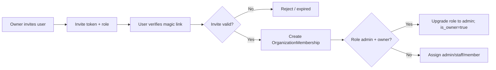
```mermaid
flowchart LR
    A[Owner invites user] --> B[Invite token + role]
    B --> C[User verifies magic link]
    C --> D{Invite valid?}
    D -- No --> E[Reject / expired]
    D -- Yes --> F[Create OrganizationMembership]
    F --> G{Role admin + owner?}
    G -- Yes --> H[Upgrade role to admin; is_owner=true]
    G -- No --> I[Assign admin/staff/member]
```

---

## 3. Venue and seating setup

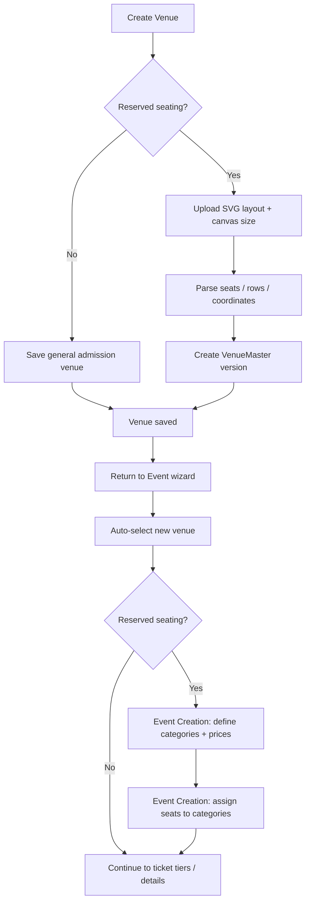
```mermaid
flowchart TD
    A[Create Venue] --> B{Reserved seating?}
    B -- No --> C[Save general admission venue]
    B -- Yes --> D[Upload SVG layout + canvas size]
    D --> E[Parse seats / rows / coordinates]
    E --> F[Create VenueMaster version]
    C --> G[Venue saved]
    F --> G
    G --> H[Return to Event wizard]
    H --> I[Auto-select new venue]
    I --> J{Reserved seating?}
    J -- Yes --> K[Event Creation: define categories + prices]
    K --> L[Event Creation: assign seats to categories]
    J -- No --> M[Continue to ticket tiers / details]
    L --> M
```

Venue creation owns geometry. Event Creation owns category composition and pricing.

### 3.1 Venue versioning

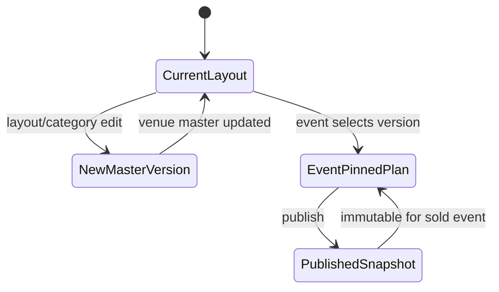
```mermaid
stateDiagram-v2
    [*] --> CurrentLayout
    CurrentLayout --> NewMasterVersion: layout/category edit
    NewMasterVersion --> CurrentLayout: venue master updated
    CurrentLayout --> EventPinnedPlan: event selects version
    EventPinnedPlan --> PublishedSnapshot: publish
    PublishedSnapshot --> EventPinnedPlan: immutable for sold event
```

---

## 4. Event creation and publishing

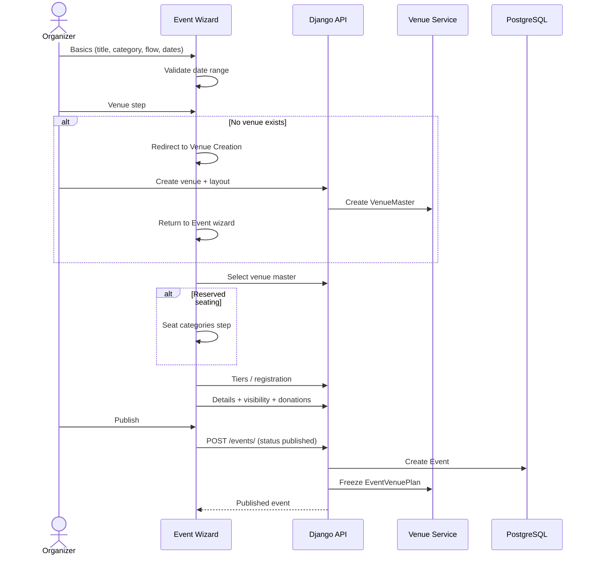
```mermaid
sequenceDiagram
    actor O as Organizer
    participant W as Event Wizard
    participant API as Django API
    participant V as Venue Service
    participant DB as PostgreSQL

    O->>W: Basics (title, category, flow, dates)
    W->>W: Validate date range
    O->>W: Venue step
    alt No venue exists
        W->>W: Redirect to Venue Creation
        O->>API: Create venue + layout
        API->>V: Create VenueMaster
        W->>W: Return to Event wizard
    end
    W->>API: Select venue master
    alt Reserved seating
        W->>W: Seat categories step
    end
    W->>API: Tiers / registration
    W->>API: Details + visibility + donations
    O->>W: Publish
    W->>API: POST /events/ (status published)
    API->>DB: Create Event
    API->>V: Freeze EventVenuePlan
    API-->>W: Published event
```

### 4.1 Event lifecycle

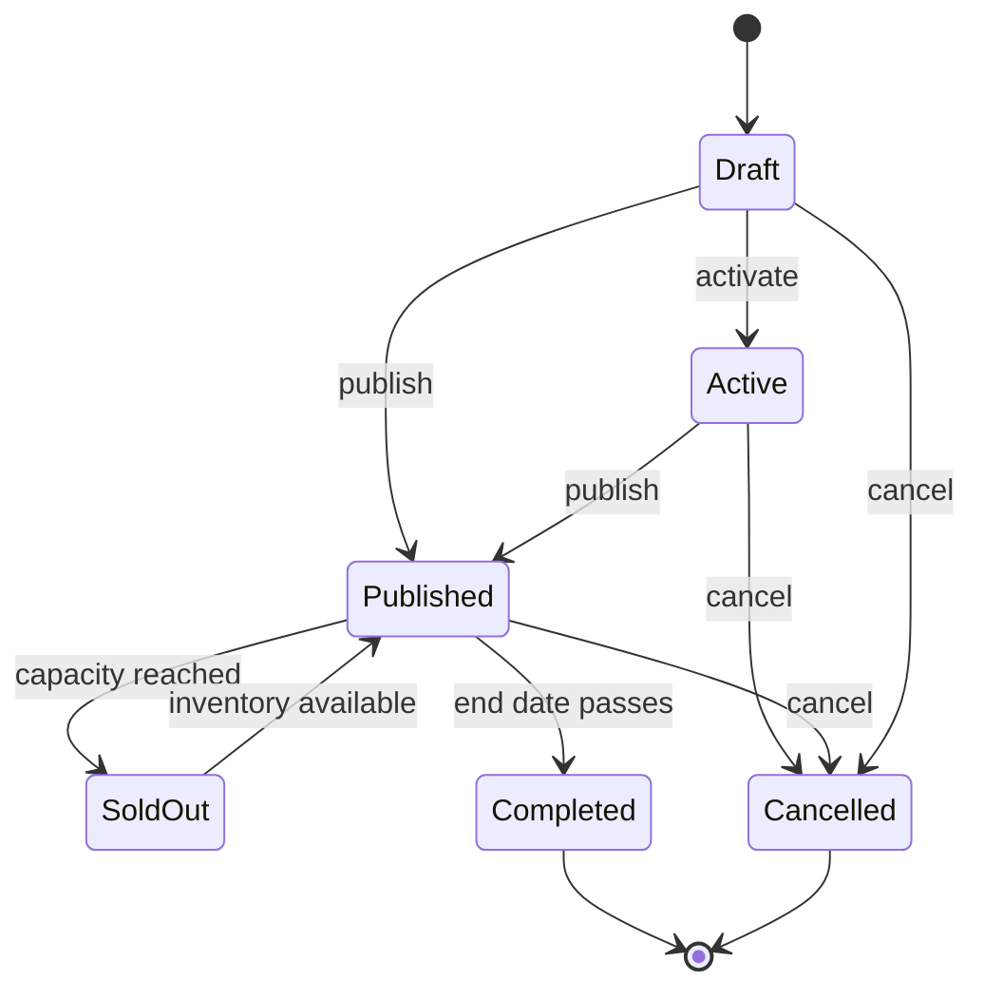
```mermaid
stateDiagram-v2
    [*] --> Draft
    Draft --> Active: activate
    Draft --> Published: publish
    Active --> Published: publish
    Published --> SoldOut: capacity reached
    SoldOut --> Published: inventory available
    Published --> Completed: end date passes
    Active --> Cancelled: cancel
    Published --> Cancelled: cancel
    Draft --> Cancelled: cancel
    Completed --> [*]
    Cancelled --> [*]
```

---

## 5. Booking and checkout

### 5.1 Ticketed flow

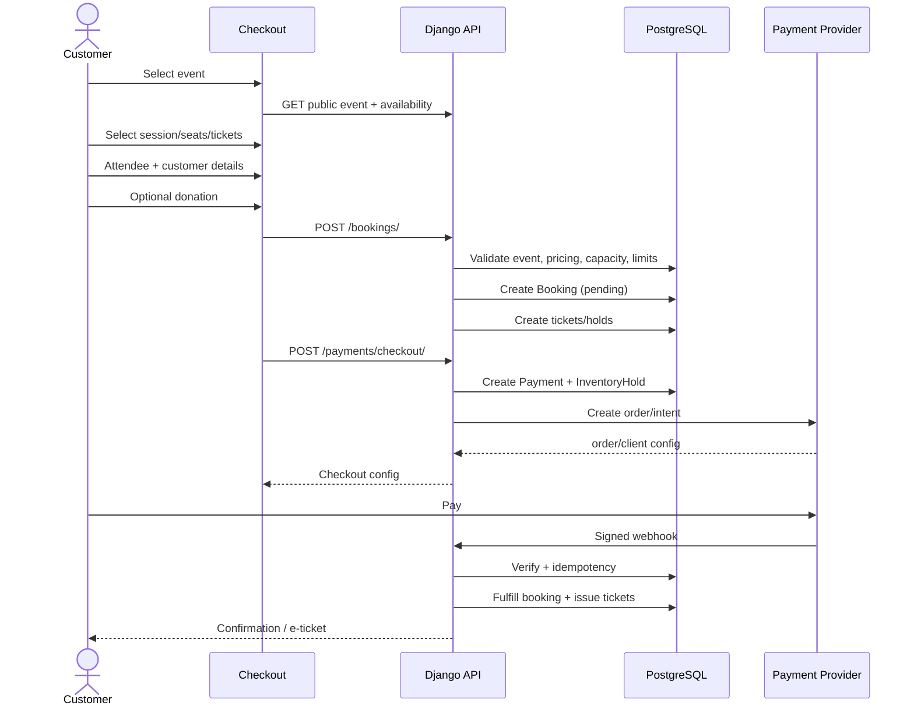
```mermaid
sequenceDiagram
    actor C as Customer
    participant UI as Checkout
    participant API as Django API
    participant DB as PostgreSQL
    participant P as Payment Provider

    C->>UI: Select event
    UI->>API: GET public event + availability
    C->>UI: Select session/seats/tickets
    C->>UI: Attendee + customer details
    C->>UI: Optional donation
    UI->>API: POST /bookings/
    API->>DB: Validate event, pricing, capacity, limits
    API->>DB: Create Booking (pending)
    API->>DB: Create tickets/holds
    UI->>API: POST /payments/checkout/
    API->>DB: Create Payment + InventoryHold
    API->>P: Create order/intent
    P-->>API: order/client config
    API-->>UI: Checkout config
    C->>P: Pay
    P->>API: Signed webhook
    API->>DB: Verify + idempotency
    API->>DB: Fulfill booking + issue tickets
    API-->>C: Confirmation / e-ticket
```

### 5.2 Free registration flow

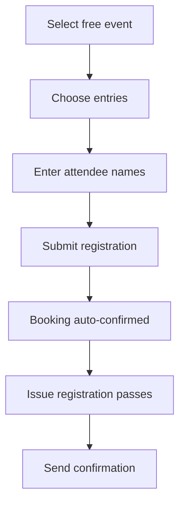
```mermaid
flowchart TD
    A[Select free event] --> B[Choose entries]
    B --> C[Enter attendee names]
    C --> D[Submit registration]
    D --> E[Booking auto-confirmed]
    E --> F[Issue registration passes]
    F --> G[Send confirmation]
```

### 5.3 Booking status state

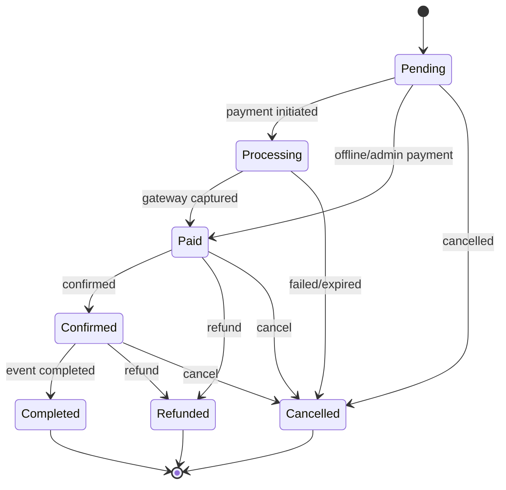
```mermaid
stateDiagram-v2
    [*] --> Pending
    Pending --> Processing: payment initiated
    Pending --> Paid: offline/admin payment
    Processing --> Paid: gateway captured
    Processing --> Cancelled: failed/expired
    Pending --> Cancelled: cancelled
    Paid --> Confirmed: confirmed
    Confirmed --> Completed: event completed
    Paid --> Refunded: refund
    Confirmed --> Refunded: refund
    Paid --> Cancelled: cancel
    Confirmed --> Cancelled: cancel
    Completed --> [*]
    Cancelled --> [*]
    Refunded --> [*]
```

### 5.4 Seat hold lifecycle

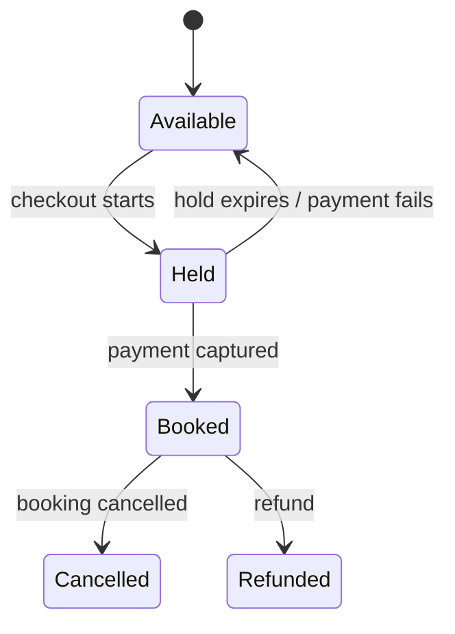
```mermaid
stateDiagram-v2
    [*] --> Available
    Available --> Held: checkout starts
    Held --> Booked: payment captured
    Held --> Available: hold expires / payment fails
    Booked --> Cancelled: booking cancelled
    Booked --> Refunded: refund
```

---

## 6. Ticket issuance and transfer

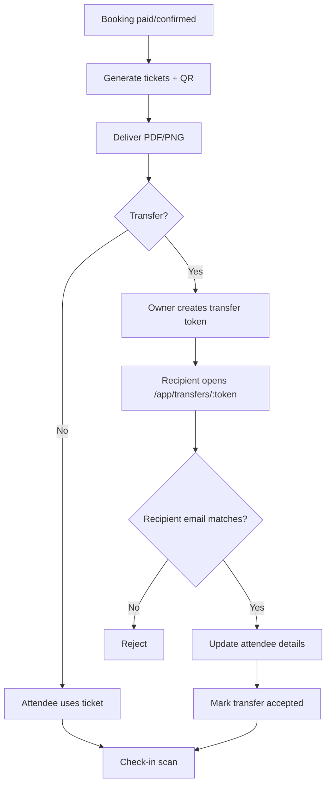
```mermaid
flowchart TD
    A[Booking paid/confirmed] --> B[Generate tickets + QR]
    B --> C[Deliver PDF/PNG]
    C --> D{Transfer?}
    D -- No --> E[Attendee uses ticket]
    D -- Yes --> F[Owner creates transfer token]
    F --> G[Recipient opens /app/transfers/:token]
    G --> H{Recipient email matches?}
    H -- No --> I[Reject]
    H -- Yes --> J[Update attendee details]
    J --> K[Mark transfer accepted]
    E --> L[Check-in scan]
    K --> L
```

Transfer acceptance also regenerates the ticket code and QR. The previous QR must no longer be accepted. The current implementation returns the accept token to the caller; it does not automatically email the recipient.

---

## 7. Check-in

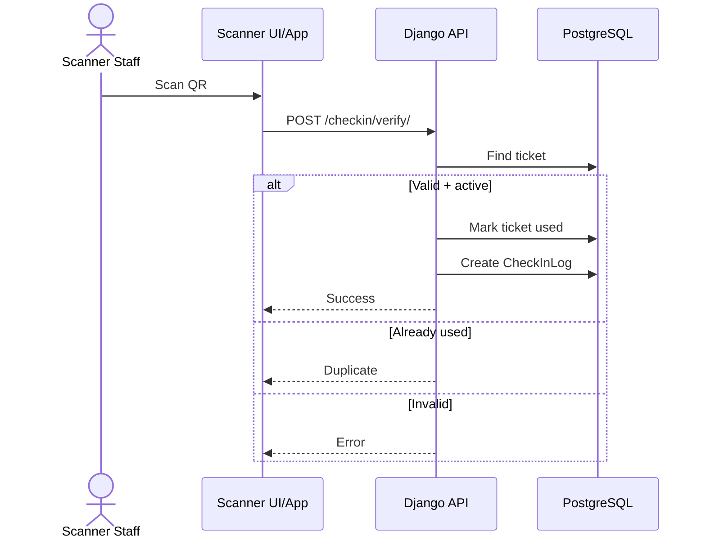
```mermaid
sequenceDiagram
    actor S as Scanner Staff
    participant UI as Scanner UI/App
    participant API as Django API
    participant DB as PostgreSQL

    S->>UI: Scan QR
    UI->>API: POST /checkin/verify/
    API->>DB: Find ticket
    alt Valid + active
        API->>DB: Mark ticket used
        API->>DB: Create CheckInLog
        API-->>UI: Success
    else Already used
        API-->>UI: Duplicate
    else Invalid
        API-->>UI: Error
    end
```

Offline mode:

1. Download offline pack.
2. Scan locally.
3. Queue scans.
4. Sync with `/checkin/offline-sync/`.
5. Resolve conflicts idempotently.

Each successful check-in creates a `CheckInLog` containing the ticket, event/session, authenticated `scanner_user`, device id, IP, location, status and offline-sync fields.

---

## 8. Membership lifecycle

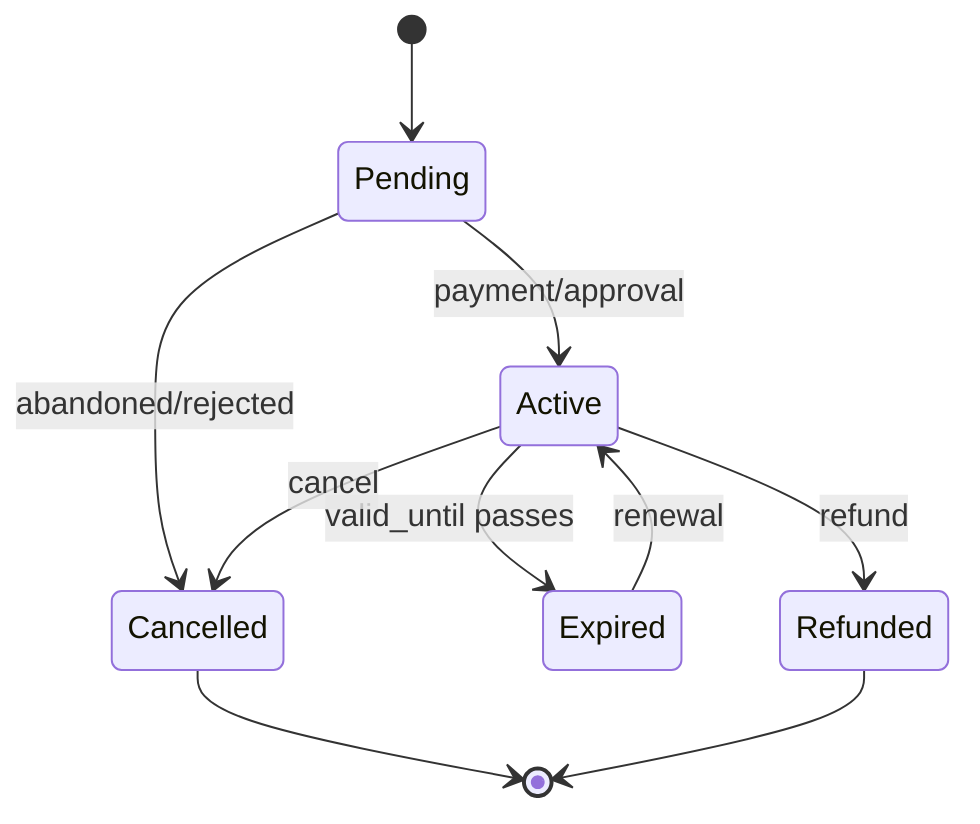
```mermaid
stateDiagram-v2
    [*] --> Pending
    Pending --> Active: payment/approval
    Pending --> Cancelled: abandoned/rejected
    Active --> Expired: valid_until passes
    Active --> Cancelled: cancel
    Active --> Refunded: refund
    Expired --> Active: renewal
    Cancelled --> [*]
    Refunded --> [*]
```

Offline membership:

1. Admin uploads CSV or creates offline request.
2. Membership = `pending_offline`.
3. Owner/admin reviews.
4. Approve → active; reject → cancelled.

---

## 9. Donation and tax receipt

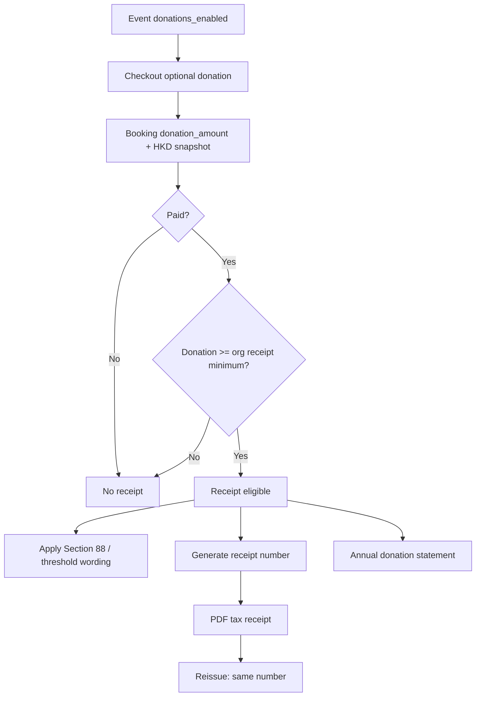
```mermaid
flowchart TD
    A[Event donations_enabled] --> B[Checkout optional donation]
    B --> C[Booking donation_amount + HKD snapshot]
    C --> D{Paid?}
    D -- No --> E[No receipt]
    D -- Yes --> F{Donation >= org receipt minimum?}
    F -- No --> E
    F -- Yes --> G[Receipt eligible]
    G --> G1[Apply Section 88 / threshold wording]
    G --> H[Generate receipt number]
    H --> I[PDF tax receipt]
    I --> J[Reissue: same number]
    G --> K[Annual donation statement]
```

Receipt eligibility uses the organisation's `donation_receipt_min_amount`; the `ird_section88` and `tax_receipt_threshold` settings decide whether statutory tax wording is printed. The old fixed HKD 2,000 rule is no longer the only criterion.

---

## 10. Feature entitlements

Feature access is resolved from the organisation's package plus per-tenant overrides. There is no subscription or plan billing in the current product.

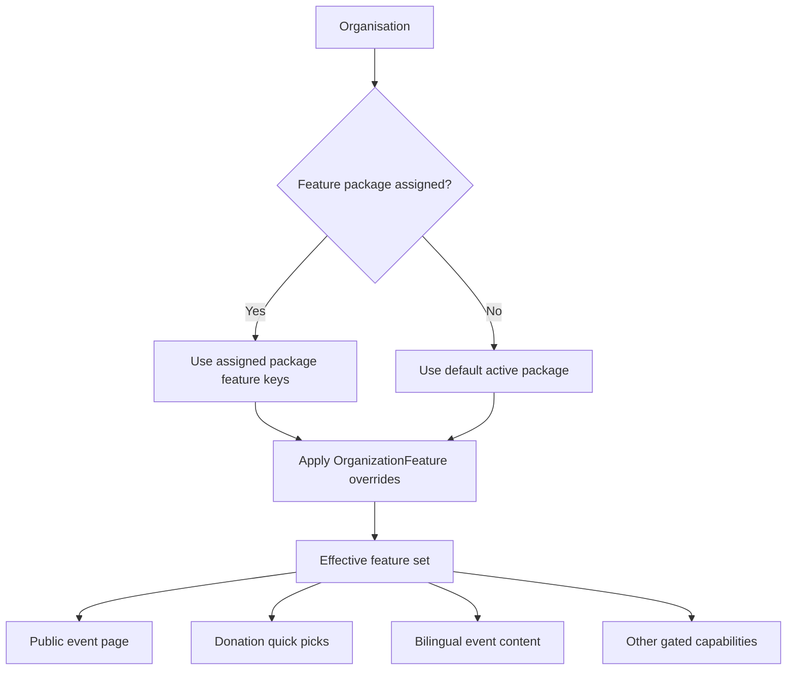
```mermaid
flowchart TD
    A[Organisation] --> B{Feature package assigned?}
    B -- Yes --> C[Use assigned package feature keys]
    B -- No --> D[Use default active package]
    C --> E[Apply OrganizationFeature overrides]
    D --> E
    E --> F[Effective feature set]
    F --> G[Public event page]
    F --> H[Donation quick picks]
    F --> I[Bilingual event content]
    F --> J[Other gated capabilities]
```

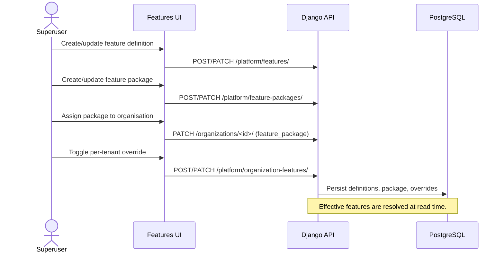
```mermaid
sequenceDiagram
    actor S as Superuser
    participant FE as Features UI
    participant API as Django API
    participant DB as PostgreSQL

    S->>FE: Create/update feature definition
    FE->>API: POST/PATCH /platform/features/
    S->>FE: Create/update feature package
    FE->>API: POST/PATCH /platform/feature-packages/
    S->>FE: Assign package to organisation
    FE->>API: PATCH /organizations/<id>/ (feature_package)
    S->>FE: Toggle per-tenant override
    FE->>API: POST/PATCH /platform/organization-features/
    API->>DB: Persist definitions, package, overrides
    Note over API,DB: Effective features are resolved at read time.
```

## 11. Payout and reconciliation

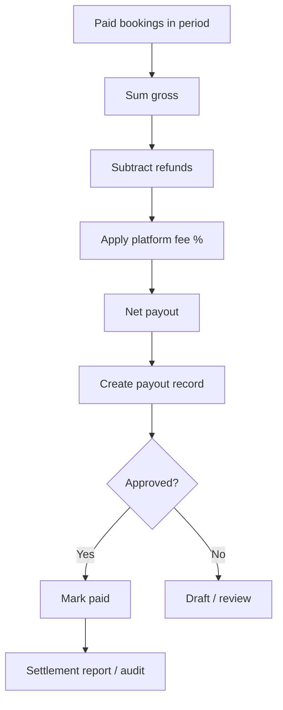
```mermaid
flowchart TD
    A[Paid bookings in period] --> B[Sum gross]
    B --> C[Subtract refunds]
    C --> D[Apply platform fee %]
    D --> E[Net payout]
    E --> F[Create payout record]
    F --> G{Approved?}
    G -- Yes --> H[Mark paid]
    G -- No --> I[Draft / review]
    H --> J[Settlement report / audit]
```

---

## 12. Audit trail

Every mutating API request can produce an audit row:

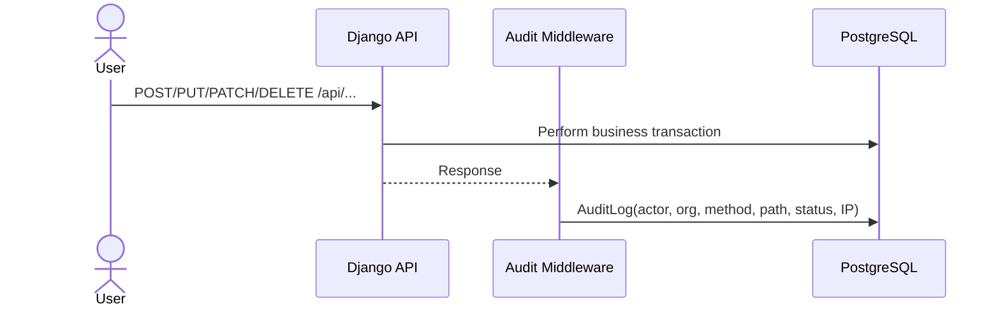
```mermaid
sequenceDiagram
    actor U as User
    participant API as Django API
    participant MW as Audit Middleware
    participant DB as PostgreSQL

    U->>API: POST/PUT/PATCH/DELETE /api/...
    API->>DB: Perform business transaction
    API-->>MW: Response
    MW->>DB: AuditLog(actor, org, method, path, status, IP)
```

---

## 13. Reporting

```mermaid
flowchart LR
    A[Date range + org] --> B[Reports API]
    B --> C[Bookings / tickets / memberships / donations]
    C --> D[Overview / Sales / Attendance / Memberships / Donations / Pending]
    D --> E[Dashboard tables]
    D --> F[CSV export]
    D --> G[Annual donation statement PDF]
```

---

## 14. Detailed workflow handoffs

### 14.1 Organisation creation and setup

| Step | Actor | Action | Data written | Next state |
|---|---|---|---|---|
| 1 | User | Register/login | User, JWT | Authenticated |
| 2 | User | Create organisation | Organization, owner membership | Organisation Active |
| 3 | Superuser | Assign feature package | `Organization.feature_package` | Features effective |
| 4 | Owner/Admin | Configure branding/contact | Organisation branding fields | Branding effective |
| 5 | Owner/Admin | Configure payment gateway | OrganizationPaymentConfig | Tenant checkout available |
| 6 | Owner/Admin | Invite team | OrganizationInvite → OrganizationMembership | Team ready |

### 14.2 Venue to event

| Step | Actor | Action | Data written |
|---|---|---|---|
| 1 | Admin | Create venue | Venue |
| 2 | Admin | Upload SVG + canvas | SeatLayout, Seat rows |
| 3 | System | Create master version | VenueMaster |
| 4 | Admin | Return to Event wizard | Event draft |
| 5 | Admin | Select venue master | EventVenuePlan |
| 6 | Admin | Define categories/prices | EventSeatCategory |
| 7 | Admin | Assign seats | Event seat assignments |
| 8 | Admin | Publish | Frozen plan snapshot |

### 14.3 Booking to check-in

| Step | Actor | Action | Data written |
|---|---|---|---|
| 1 | Customer | Select event/session/tickets | Booking draft |
| 2 | System | Validate pricing/inventory | Booking (pending), holds |
| 3 | Customer | Pay | Payment attempt |
| 4 | Gateway | Webhook | Payment paid |
| 5 | System | Fulfill | Booking paid/confirmed, Ticket rows, QR |
| 6 | Staff | Scan QR | CheckInLog, Ticket used |
| 7 | System | Report/payout | Reports, OrganizerPayout, AuditLog |

### 14.4 Donation to receipt

| Step | Actor | Action | Data written |
|---|---|---|---|
| 1 | Admin | Enable donations + presets | Event donation fields |
| 2 | Customer | Add donation at checkout | Booking.donation_amount/currency |
| 3 | System | Verify receipt eligibility | `donation_tax_eligible` |
| 4 | Admin/Customer | Download/reissue receipt | Receipt number, PDF |
| 5 | Admin | Annual statement | PDF statement |

### 14.5 Transfer

| Step | Actor | Action | Data written |
|---|---|---|---|
| 1 | Ticket owner | Request transfer | TicketTransfer pending |
| 2 | Recipient | Open token + accept | Transfer accepted |
| 3 | System | Regenerate code/QR | Ticket unique_code, qr_code |
| 4 | Recipient | Use new ticket | Check-in with new QR |

## 15. Workflow ownership matrix

| Workflow | Owner role | Admin | Staff | Member | Superuser |
|---|---|---|---|---|---|
| Create organisation | Self | Yes | No | No | Yes |
| Assign feature package | No | No | No | No | Yes |
| Invite team | Yes | Yes | No | No | Yes |
| Manage branding | Yes | Yes | No | No | Yes |
| Payment config | Yes | Yes | No | No | Yes |
| Create venue/event | Yes | Yes | No | No | Yes |
| Publish event | Yes | Yes | No | No | Yes |
| Manage bookings | Yes | Yes | Yes | Own only | Yes |
| Check-in | Yes | Yes | Yes | No | Yes |
| Reports | Yes | Yes | No | No | Yes |
| Payouts | Yes | Yes | No | No | Yes |
| Audit logs | Yes | Yes | No | No | Yes |
| Feature entitlements | No | No | No | No | Yes |
| Donation receipt | Yes | Yes | No | Own booking | Yes |
| Ticket transfer | Own | Own | Own | Own | Yes |
